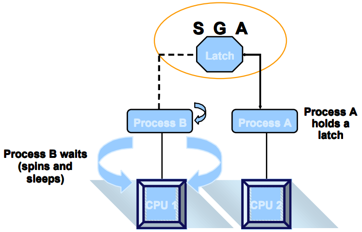

# 一、性能优化综述

## 1.1性能优化能力

- 一切的优化都要从**业务**出发 ★
- 学员对数据库优化有一个比较清晰的思路

- 能够客观的评价数据库的性能问题
- 能够比较顺利的定位到问题点
- 能够处理常见的性能问题

## 1.2 性能优化的原则

- 不是所有的数据库都需要（能够）优化
- 数据库库的性能，大多数都不是从数据库层面能够解决的
-  **在不了解业务之前，不可能找到正确的优化思路**
- **优化要有一个度**，并不是“没有最优，只有更优”

## 1.3 导致性能问题的可能原因

- 错误的执行计划
  - 表没有正确的创建**索引** 
  - 表没有及时的分析
- 热块-------数据块的争用（反向索引？）
- 锁的阻塞------业务设计缺陷
- SQL解析消耗大量CPU ----变量绑定
- 低效的SQL -----SQL自身的问题
- 数据库整体负载过程----架构设计的问题

## 1.4 性能问题的定位

**原则：**尽可能从小范围分析问题

1. SQL层

   如果能从定位到SQL，就不要从会话层面分析

   工具 执行计划，10053,10046....

2. 会话层

   如果能定位到会话，就不要从系统层面分析

   V$SESSION,V$SESSTAT,V$SESSION_WAIT,V$SQL,V$LOCK，SQL_TRACE

3. 系统层

   如果无法定位任何性能问题，从系统层面入手

   AWR（STATSPACK）,OS tools(TOP,IOSTAT....)

## 1.5 不要迷恋优化器

业务逻辑 ---优化器无能为力

业务逻辑 ---CBO无能为力

**建议：**

- **不要迷信优化器，优化器永远无法知道你的业务需求**
  - 优化器永远无法按照你的业务需求来重写你的SQL语句。
  - 优化器只能在数学（集合）逻辑上做SQL的重写。
- **高效的SQL来自于对业务的理解和对SQL执行过程的理解。只有自己才能写出性能最好的sql脚本**

## 1.6 为什么高效的SQL这么难？

1. SQL语言本质上是集合的操作

   开发者要明白业务，知道sql脚本应该满足什么查询结果

2. 语言的效率，是SQL语言的最难的地方

   tablesan

   index range scan

   index fast scan

   nested loop join

   merge join

   hash join

3. 优化器机制开发者无法掌控

## 1.7 问题思考

1. **“单纯的数据库层面的优化是没有前途的”，你怎么看？**

   数据库的优化是根据**业务的需求**而定的，不是无缘无故的优化。

   单纯从数据库层面优化显然是不全面的。有的时候整个业务的瓶颈点不在数据库，单纯的优化数据库起不到作用。**从业务的角度来看系统是否满足需求，负载量是否是正常的，是不是由于数据增长量已经超出了承受能力，业务需求的改变。**

2. 当一个有性能问题的数据库摆在你的面前，作为责任人，你的处理思路是什么？

   1. 先要弄清楚数据库的类型是什么 OLTP 在线事务处理 or OLAP 在线分析系统，因为不同的数据库类型选择优化的方法也不同。例如 OLTP 强调系统的内存命中率，内存的效率决定数据库效率。
   2. 如果用户的并发数很大可扩大内存的容量缓存更多的数据，还可以调整data buffer cache、shared pool、[java](http://www.itpub.net/pubtree/?node=207) pool、large pool的大小及PGA大小包括sort区hash区等。
   3. 如果用户的在线请求数较多，可以尝试着进行SQL的变量绑定，缓解SQL的硬解析，当遇到成千上万的查询操作时，能够不经过解析过程直接使用缓存的 执行计划，那效率可以提高n倍。因为硬解析会做2个分析。第一 语法分析：检查代码的语法是否正确。第二 语义分析：检查代码执行的对象是否存在及对执行对象的权限是否有。解析过程十分的耗费CPU资源。
   4. 数据块的争用，是因为数据分配的不均匀造成的，可以使用hash算法平均打散到各个磁盘上来减少热块的产生。
   5. 还有很多系统性能间接的反应为数据库性能，例如 网络的延迟 主机的应用程序较多 没有采用中间件策略构建预处理缓冲池。
   6. 如果是OLAP 在线分析系统的话，当一个用户找你来说查询一张报表很慢，你可以通过用户会话来找到查询的SQL语句，检查这条语句逻辑上效率如何，可以使用Hint方式 来改变sql的执行计划，检查数据的访问方式，是走全表扫描还是走索引效率最高，调整SQL的执行计划，选择合适的索引。
   7. 因为SQL大多数就是集合的数学运算操作，SQL表的关联方式是不是最优化，哪种join最适合，这都是要考虑的范围。
   8. 当你手工测试完后，对表进行统计分析，看看优化器和你选的执行计划是不是相同的。
   9. CBO模式的选择，对于需要快速响应用户的请求，可以设置成first_rows(优先把部分数据返回)，对于用户响应不是很严格的业务，可以设置成all_rows（所有处理数据一次性返回。
   10. 如果系统的整体开销不大，可以考虑并行技术。
   11. 对于OLAP系统最直接的提高数据库性能方法增加磁盘I/O和CPU吞吐量，如果硬件搞不了，可以采用数据库压缩技术，减少空间提高I/O。
   12. 随着数据量的增加，以前不是问题的问题也变成了问题，对于OLAP系统SQL的效率决定数据库效率。
   13. 统计信息，索引，分区，迁移历史数据，ASM。
   14. vmstat 、iostat 的报告 查看 os层面是否正常工作,有异常则采取措。

# 二、锁

## 2.1 为什么会有锁？

没有并发就没有锁

## 2.2 锁的分类

- Enqueues（lock）：队列类型的锁，通常和业务相关的
- Latches：系统资源方面的锁，比如内存结构，SQL解析

### 2.2.1 Enqueues & Latches 对比

|        | Latch            | Lock                 |
| ------ | ---------------- | -------------------- |
| 队列性 |                  |                      |
| 时长   | 很短             | 可能很长             |
| 层面   | 数据库资源层     | 业务应用层           |
| 目的   | 保证资源的完整性 | 保证业务操作的完整性 |

## 2.3 Enqueues（lock）

Enqueue 是Oracle使用的另一种锁定机制，它更加复杂，**允许几个并发进程不同程度地共享某些资源**。任何可被并发使用的对象均可使用enqueue加以保护。一 个典型的例子是表的锁定，我们允许在一个表上有不同级别的共享。与latch不同之处在于，enqueue是使用操作系统特定的锁定机制，一个 enqueue允许用户在锁上存贮一个标记，来表明请求锁的模式。操作系统lock manager跟踪所有被锁定的资源，如果某个进程不能获取它所请求的那种锁，操作系统就把请求进程置于一个等待队列中，该队列按FIFO原则调度，而在 latches中是没有象enqueue中排序的等待队列，latch等待进程要么使用定时器来唤醒和重试，要么spin(只用于多处理器情况下)。

### 2.3.1 锁的原则

- 只有被修改时，行才会被锁定。
- 当一条语句修改了一条记录，只有这条记录上被锁定，在Oracle数据库中不存在锁升级。
- 当某行被修改时，它将阻塞别人对它的修改。
- 当一个事务修改一行时，将在这个行上加上行锁（TX），用于阻止其它事务对相同行的修改。
- 读永远不会阻止写。
- 读不会阻塞写，但有唯一的一个例外，就是select ...for update。
- 写永远不会阻塞读。
- 当一行被修改后，Oracle通过回滚段提供给数据的一致性读。

### 2.3.2 锁的类型

#### 2.3.2.1 TM锁（表锁）

发生在insert, update, delete以及select for update操作时，目的是保证操作能够正常进行，并且阻止其它人对表执行DDL操作。

**TM锁几种模式的互斥关系**

| 模式 | 名称                                                         | 锁定的sql                                           | 排斥的模式 | 允许的dml                                 |
| ---- | ------------------------------------------------------------ | --------------------------------------------------- | ---------- | ----------------------------------------- |
| 2    | 行级共享锁，其他对象只能查询这些数据                         | lock table table_name in row  share mode;           | 6          | select,insert,update，delete，for  update |
| 3    | 行级排他锁，在事务提交前不允许做DML操作                      | lock table table_name in row  exclusive mode;       | 4,5,6      | select,insert,update,delete，for  update  |
| 4    | 共享锁，不允许DML,但是允许其他用户发出select …from for update命令对表添加RS锁 | lock table table_name in share  mode;               | 3,5,6      | select                                    |
| 5    | 共享行级排他锁，不能对相同的表进行DML操作，也不能添加共享锁  | lock table table_name in share  row exclusive mode; | 3,4,5,6    | select                                    |
| 6    | 排他锁，其他用户不能对表进行任何的DML和DDL操作，该表上只能进行查询 | lock table table_name in  exclusive mode;           | 2,3,4,5,6  | select                                    |

#### 2.3.2.2 TX锁 【事务锁（行锁）】

对于正在修改的数据，阻止其它会话进行修改。

#### 2.3.2.3 RI锁

基于引用关系的锁定，当对具有**主外键**关系的表做DML操作时，锁定不单单发生在操作表上，相应的引用表 上也可能加上相应的锁定。

#### 2.3.2.4 死锁

两个会话互相持有对方资源导致死锁。

#### 2.3.2.5 结论

- 通过锁定，可以达到预期的业务需求。
- 通过对业务深入的分析，可以最大程度的避免不必要锁定的发生。

## 2.4 Latch

Latch是用于保护SGA（System Global Area）系统全局区中共享数据结构的一种**串行化**锁定机制。Latch的实现是与操作系统相关的，尤其和一个进程是否需要等待一个latch、需要等待多长时间有关。

 Latch 是一种能够极快地被获取和释放的锁，它通常用于保护描述buffer cache中block的数据结构。与每个latch相联系的还有一个清除过程，当持有latch的进程成为死进程时，该清除过程就会被调用。Latch 还具有相关级别，用于防止死锁，一旦一个进程在某个级别上得到一个latch，它就不可能再获得等同或低于该级别的latch。

当一个进程准备访问SGA中的数据结构时，它就需要获得一个latch。当进程获得latch后，它将一直持有该latch直到它不再使用此数据结构，这时latch才会被释放。可通过latch名称来区分它所保护的不同数据结构。

Oracle 使用元指令对latch进行操作, 当所需的latch已被其他进程持有时，执行指令进程将停止执行部分指令，直到该latch被释放为止。从根本上讲，latch防止并发访问共享数据结 构，由于设置和释放latch的指令是不可分割的，操作系统就可以保证只有一个进程获得latch，又由于这只是单条指令，所以执行速度很快。latch 被持有的时间是很短，而且提供了当持有者不正常中断时的清除机制，该清除工作是由Oracle后台进程PMON来完成的。

### 2.4.1 Latch 的目的

- 保证资源的串行访问：
  - 保护SGA的资源访问
  - 保护内存的分配
- 保证执行的串行化：
  - 保护关键资源的串行执行
  - 防止内存结构损坏

### 2.4.2 Latch 的机制

