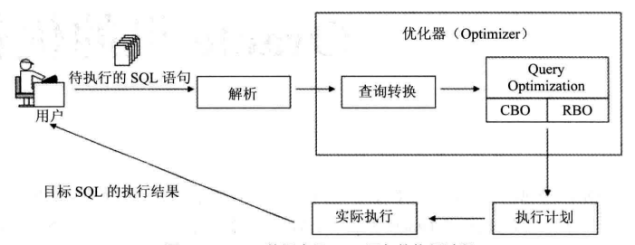

# 一、性能优化综述

## 1.1性能优化能力

- 一切的优化都要从**业务**出发 ★
- 学员对数据库优化有一个比较清晰的思路

- 能够客观的评价数据库的性能问题
- 能够比较顺利的定位到问题点
- 能够处理常见的性能问题

## 1.2 性能优化的原则

- 不是所有的数据库都需要（能够）优化
- 数据库库的性能，大多数都不是从数据库层面能够解决的
- **在不了解业务之前，不可能找到正确的优化思路**
- **优化要有一个度**，并不是“没有最优，只有更优”

## 1.3 导致性能问题的可能原因

- 错误的执行计划
  - 表没有正确的创建**索引** 
  - 表没有及时的分析
- 热块-------数据块的争用（反向索引？）
- 锁的阻塞------业务设计缺陷
- SQL解析消耗大量CPU ----变量绑定
- 低效的SQL -----SQL自身的问题
- 数据库整体负载过程----架构设计的问题

## 1.4 性能问题的定位

**原则**：尽可能从小范围分析问题

1. SQL层

   如果能从定位到SQL，就不要从会话层面分析

   工具 执行计划，10053,10046....

2. 会话层

   如果能定位到会话，就不要从系统层面分析

   V$SESSION,V$SESSTAT,V$SESSION_WAIT,V$SQL,V$LOCK，SQL_TRACE

3. 系统层

   如果无法定位任何性能问题，从系统层面入手

   AWR（STATSPACK）,OS tools(TOP,IOSTAT....)

## 1.5 不要迷恋优化器

业务逻辑 ---优化器无能为力

业务逻辑 ---CBO无能为力

**建议**：

- **不要迷信优化器，优化器永远无法知道你的业务需求**
  - 优化器永远无法按照你的业务需求来重写你的SQL语句。
  - 优化器只能在数学（集合）逻辑上做SQL的重写。
- **高效的SQL来自于对业务的理解和对SQL执行过程的理解。只有自己才能写出性能最好的sql脚本**

## 1.6 为什么高效的SQL这么难？

1. SQL语言本质上是集合的操作

   开发者要明白业务，知道sql脚本应该满足什么查询结果

2. 语言的效率，是SQL语言的最难的地方

   tablesan

   index range scan

   index fast scan

   nested loop join

   merge join

   hash join

3. 优化器机制开发者无法掌控

## 1.7 问题思考

1. **“单纯的数据库层面的优化是没有前途的”，你怎么看？**

   数据库的优化是根据**业务的需求**而定的，不是无缘无故的优化。

   单纯从数据库层面优化显然是不全面的。有的时候整个业务的瓶颈点不在数据库，单纯的优化数据库起不到作用。**从业务的角度来看系统是否满足需求，负载量是否是正常的，是不是由于数据增长量已经超出了承受能力，业务需求的改变。**

2. 当一个有性能问题的数据库摆在你的面前，作为责任人，你的处理思路是什么？

   1. 先要弄清楚数据库的类型是什么 OLTP 在线事务处理 or OLAP 在线分析系统，因为不同的数据库类型选择优化的方法也不同。例如 OLTP 强调系统的内存命中率，内存的效率决定数据库效率。
   2. 如果用户的并发数很大可扩大内存的容量缓存更多的数据，还可以调整data buffer cache、shared pool、[java](http://www.itpub.net/pubtree/?node=207) pool、large pool的大小及PGA大小包括sort区hash区等。
   3. 如果用户的在线请求数较多，可以尝试着进行SQL的变量绑定，缓解SQL的硬解析，当遇到成千上万的查询操作时，能够不经过解析过程直接使用缓存的 执行计划，那效率可以提高n倍。因为硬解析会做2个分析。第一 语法分析：检查代码的语法是否正确。第二 语义分析：检查代码执行的对象是否存在及对执行对象的权限是否有。解析过程十分的耗费CPU资源。
   4. 数据块的争用，是因为数据分配的不均匀造成的，可以使用hash算法平均打散到各个磁盘上来减少热块的产生。
   5. 还有很多系统性能间接的反应为数据库性能，例如 网络的延迟 主机的应用程序较多 没有采用中间件策略构建预处理缓冲池。
   6. 如果是OLAP 在线分析系统的话，当一个用户找你来说查询一张报表很慢，你可以通过用户会话来找到查询的SQL语句，检查这条语句逻辑上效率如何，可以使用Hint方式 来改变sql的执行计划，检查数据的访问方式，是走全表扫描还是走索引效率最高，调整SQL的执行计划，选择合适的索引。
   7. 因为SQL大多数就是集合的数学运算操作，SQL表的关联方式是不是最优化，哪种join最适合，这都是要考虑的范围。
   8. 当你手工测试完后，对表进行统计分析，看看优化器和你选的执行计划是不是相同的。
   9. CBO模式的选择，对于需要快速响应用户的请求，可以设置成first_rows(优先把部分数据返回)，对于用户响应不是很严格的业务，可以设置成all_rows（所有处理数据一次性返回。
   10. 如果系统的整体开销不大，可以考虑并行技术。
   11. 对于OLAP系统最直接的提高数据库性能方法增加磁盘I/O和CPU吞吐量，如果硬件搞不了，可以采用数据库压缩技术，减少空间提高I/O。
   12. 随着数据量的增加，以前不是问题的问题也变成了问题，对于OLAP系统SQL的效率决定数据库效率。
   13. 统计信息，索引，分区，迁移历史数据，ASM。
   14. vmstat 、iostat 的报告 查看 os层面是否正常工作,有异常则采取措。


# 二、锁

## 2.1 为什么会有锁？

没有并发就没有锁

## 2.2 锁的分类

- Enqueues（lock）：队列类型的锁，通常和业务相关的
- Latches：系统资源方面的锁，比如内存结构，SQL解析

### 2.2.1 Enqueues & Latches 对比

|        | Latch            | Lock                 |
| ------ | ---------------- | -------------------- |
| 队列性 | √                | ×                    |
| 时长   | 很短             | 可能很长             |
| 层面   | 数据库资源层     | 业务应用层           |
| 目的   | 保证资源的完整性 | 保证业务操作的完整性 |


## 2.3 Enqueues（lock）

Enqueue 是Oracle使用的另一种锁定机制，它更加复杂，**允许几个并发进程不同程度地共享某些资源**。任何可被并发使用的对象均可使用enqueue加以保护。一 个典型的例子是表的锁定，我们允许在一个表上有不同级别的共享。与latch不同之处在于，enqueue是使用操作系统特定的锁定机制，一个 enqueue允许用户在锁上存贮一个标记，来表明请求锁的模式。操作系统lock manager跟踪所有被锁定的资源，如果某个进程不能获取它所请求的那种锁，操作系统就把请求进程置于一个等待队列中，该队列按FIFO原则调度，而在 latches中是没有象enqueue中排序的等待队列，latch等待进程要么使用定时器来唤醒和重试，要么spin(只用于多处理器情况下)。

### 2.3.1 锁的原则

- 只有被修改时，行才会被锁定。
- 当一条语句修改了一条记录，只有这条记录上被锁定，在Oracle数据库中不存在锁升级。
- 当某行被修改时，它将阻塞别人对它的修改。
- 当一个事务修改一行时，将在这个行上加上行锁（TX），用于阻止其它事务对相同行的修改。
- 读永远不会阻止写。
- 读不会阻塞写，但有唯一的一个例外，就是select ...for update。
- 写永远不会阻塞读。
- 当一行被修改后，Oracle通过回滚段提供给数据的一致性读。

### 2.3.2 锁的类型

#### 2.3.2.1 TM锁（表锁）

发生在insert, update, delete以及select for update操作时，目的是保证操作能够正常进行，并且阻止其它人对表执行DDL操作。

**TM锁几种模式的互斥关系**

| 模式 | 名称                                                         | 锁定的sql                                           | 排斥的模式 | 允许的dml                                 |
| ---- | ------------------------------------------------------------ | --------------------------------------------------- | ---------- | ----------------------------------------- |
| 2    | 行级共享锁，其他对象只能查询这些数据                         | lock table table_name in row  share mode;           | 6          | select,insert,update，delete，for  update |
| 3    | 行级排他锁，在事务提交前不允许做DML操作                      | lock table table_name in row  exclusive mode;       | 4,5,6      | select,insert,update,delete，for  update  |
| 4    | 共享锁，不允许DML,但是允许其他用户发出select …from for update命令对表添加RS锁 | lock table table_name in share  mode;               | 3,5,6      | select                                    |
| 5    | 共享行级排他锁，不能对相同的表进行DML操作，也不能添加共享锁  | lock table table_name in share  row exclusive mode; | 3,4,5,6    | select                                    |
| 6    | 排他锁，其他用户不能对表进行任何的DML和DDL操作，该表上只能进行查询 | lock table table_name in  exclusive mode;           | 2,3,4,5,6  | select                                    |

#### 2.3.2.2 TX锁 【事务锁（行锁）】

对于正在修改的数据，阻止其它会话进行修改。

#### 2.3.2.3 RI锁

基于引用关系的锁定，当对具有**主外键**关系的表做DML操作时，锁定不单单发生在操作表上，相应的引用表 上也可能加上相应的锁定。

#### 2.3.2.4 死锁

两个会话互相持有对方资源导致死锁。

#### 2.3.2.5 结论

- 通过锁定，可以达到预期的业务需求。
- 通过对业务深入的分析，可以最大程度的避免不必要锁定的发生。

## 2.4 Latch

Latch是用于保护SGA（System Global Area）系统全局区中共享数据结构的一种**串行化**锁定机制。Latch的实现是与操作系统相关的，尤其和一个进程是否需要等待一个latch、需要等待多长时间有关。

 Latch 是一种能够极快地被获取和释放的锁，它通常用于保护描述buffer cache中block的数据结构。与每个latch相联系的还有一个清除过程，当持有latch的进程成为死进程时，该清除过程就会被调用。Latch 还具有相关级别，用于防止死锁，一旦一个进程在某个级别上得到一个latch，它就不可能再获得等同或低于该级别的latch。

当一个进程准备访问SGA中的数据结构时，它就需要获得一个latch。当进程获得latch后，它将一直持有该latch直到它不再使用此数据结构，这时latch才会被释放。可通过latch名称来区分它所保护的不同数据结构。

Oracle 使用元指令对latch进行操作, 当所需的latch已被其他进程持有时，执行指令进程将停止执行部分指令，直到该latch被释放为止。从根本上讲，latch防止并发访问共享数据结 构，由于设置和释放latch的指令是不可分割的，操作系统就可以保证只有一个进程获得latch，又由于这只是单条指令，所以执行速度很快。latch 被持有的时间是很短，而且提供了当持有者不正常中断时的清除机制，该清除工作是由Oracle后台进程PMON来完成的。

### 2.4.1 Latch 的目的

- 保证资源的串行访问：
  - 保护SGA的资源访问
  - 保护内存的分配
- 保证执行的串行化：
  - 保护关键资源的串行执行
  - 防止内存结构损坏

### 2.4.2 Latch 分类

```sql
select name from v$latchname;
```

latch有40余种，但作为DBA关心的主要应有以下几种：

  **Cache buffers chains latch**: 当用户进程搜索SGA寻找database cache buffers时需要使用此latch。

  **Cache buffers LRU chain latch**: 当用户进程要搜索buffer cache中包括所有 dirty blocks的LRU (least recently used) 链时使用该种latch。

  **Redo log buffer latch**: 这种latch控制redo log buffer中每条redo entries的空间分配。

  **Row cache objects latch**: 当用户进程访问缓存的数据字典数值时，将使用Row cache objects latch。

### 2.4.3 Latch 的机制


### 2.4.4 Latch的获取

#### 2.4.4.1  Willing-to-wait

如果所请求的latch不能立即得到，请求进程将等待一很短的时间后再次发出请求。进程一直重复此过程直到得到latch。

- **spin**：当一个会话无法获得需要的latch时，会继续使用CPU(CPU 空转），达到一个间隔后， 再次尝试申请latch，直到达到最大的重试次数。
- **sleep**：当一个会话无法获得需要的latch时，会等待一段时间（sleep)，达到一个间隔后，再次 尝试申请latch,如此反复，直到达到最大的重试次数。

#### 2.4.4.2 Immediate

如果所请求的latch不能立即得到，不会发生sleep或者spin，而是去获取其它可用的Latch继续执行下去。

#### 2.4.4.3 latch优化思路

Latch导致的性能问题，通常是一个系统层面的问题：

- AWR报告是一个比较好的入口
- 通过动态视图v$latch..可以分析当前系统的latch资源情况
- 确定争用最大的Latch
- 分析可能的原因
- 从应用层面和数据库层面考虑解决途径。

# 三、优化器

## 3.1 概述

优化器（Optimizer）是oracle数据库中内置的一个核心系统/核心组件/模块。目的是按照一定的判断原则来得到它认为的目标SQL在当前情形下最高的执行路径（Access Path），即为了得到目标SQL的执行计划。
依据选择执行计划时所用到的判断原则，优化器可以分为RBO和CBO：RBO(Rule-Based Optimizer)是基于规则的优化器。CBO(Cost-Based Optimizer)是基于成本的优化器。

在得到目标SQL的执行计划时，RBO所用的判断原则为一组内置的规则，这些规则是硬编码在Oracle 数据库的代码中的，RBO 会根据这些规则从目标SQL诸多可能的执行路径中选择一条 来作为其执行计划；
而CBO所用的判断原则为成本,CBO会从目标SQL诸多可能的执行路径中选择**成本值最小**的一条来作为其执行计划，各个执行路径的成本值是根据目标SQL语句所涉及的表、索引、列等相关对象的**统计信息**计算出来的。

oracle数据库里SQL语句的执行过程可以用下图来表示：



**注意**：优化器的输入是经过解析后（检查目标SQL的语法、语义和权限）的目标SQL，输出是目标SQL的执行计划。

## 3.2 RBO & CBO

### 3.2.1 RBO

之前已经提到，基于规则的优化器（RBO）通过硬编码在Oracle数据库代码中的一系列固定的规则，来决定目标SQL的执行计划。具体来说就是这样: Oracle 会在代码里事先给各种类型的执行路径定一个等级，一共有15个等级，从等级1到等级15。并且Oracle会认为等级值低的执行路径的执行效率会比等级值高的执行效率要高，也就是说在RBO的眼里，等级1所对应的执行路径的执行效率最高，等级15所对应的执行路径的执行效率最低。在决定目标SQL的执行计划时，如果可能的执行路径不止一条，则RBO就会从该SQL诸多可能的执行路径中选择一条等级值最低的执行路径来作为其执行计划。

在Oracle数据库里，对于OLTP类型的SQL语句而言，显然通过ROWID来访问是效率最高的方式，而通过全表扫描来访问则是效率最低的方式。与之相对应的，RBO内置的等级1所对应的执行路径就是“single row by rowid (通过rowid来访问单行数据)”，而等级15所对应的执行路径则是“full table scan (全表扫描)”。

和CBO相比，RBO是有其明显缺陷的。在使用RBO的情况下，执行计划一旦出了问题，很难对其做调
整；另外，如果使用了RBO，则目标SQL的写法，甚至是目标SQL中所涉及的各个对象在该SQL文本中出现的先后顺序，都可能会影响RBO对于该SQL执行计划的选择。更糟糕的是，Oracle数据库中很多很好的特性、功能均不能在RBO下使用，因为RBO不支持。

只要出现如下情况，即使修改了优化器的模式或者使用了RULE Hint，oracle依然不回使用RBO，而是强制使用CBO：

- 目标SQL中涉及的对象有IOT（Index Origanized Table）
- 目标SQL中涉及的对象有分区表
- 使用了并行查询或着并行DML
- 使用了星型连接
- 使用了哈希连接
- 使用了索引快速全扫描
- 使用了函数索引
- ......

一旦RBO选择的执行计划并不是当前情形下最优的执行计划，我们很难对RBO选择的执行计划做调整，其中非常关键的一个原因就是不能使用Hint，使用了Hint就自动启用了CBO。

### 3.2.2 CBO

我们在3.2节中已经提到RBO 是有明显缺陷的，比如Oracle数据库中很多很好的功能、特性是RBO不支持的，RBO产生的执行计划很难调整等，但这些还不是最要命的，**RBO最大的问题在于它是靠硬编码在Oracle数据库代码中的一系列固定的规则来决定目标SQL的执行计划的，而并没有考虑目标SQL中所涉及的对象的实际数据量、实际数据分布等情况**，这样一旦固定 的规则并不适用于该SQL中所涉及的实际对象时，RBO根据固定规则产生的执行计划就很可能不是当前情况下的最优执行计划了。

为了解决RBO的上述先天缺陷，从Oracle 7开始，Oracle 就引入了CBO。之前已经提到过，CBO在选择目标SQL的执行计划时，所用的判断原则为成本，CBO会从目标SQL诸多可能的执行路径中选择一条成本值最小的执行路径来作为其执行计划，各条执行路径的成本值是根据目标SQL语句所涉及的表、索引、列等相关对象的统计信息计算出来的。

这里的成本是指Oracle根据相关对象的统计信息计算出来的一个值，它实际上代表了Oracle根据相关统计信息估算出来的目标SQL的对应执行步骤的I/O、CPU和网络资源的消耗量，这也就意味着Oracle数据库里的成本实际，上就是对执行目标SQL所要耗费的I/O、CPU和网络资源的一个估算值。

CBO会认为那些消耗系统I/O和CPU资源最少的执行路径就是当前情况下的最佳选择。

接下来介绍CBO的一些基本概念。

#### 3.2.2.1 Cardinality

集的势，表示对目标SQL的某个具体执行步骤的执行结果所包含记录数的估算。如果是针对整个目标SQL，那么表示对该SQL最终执行结果所包含记录数的估算。

Cardinality和成本值的估算是息息相关的，因为Oracle得到指定结果集所需要耗费的IO资源可以近似看作随着该结果集所包含记录数的递增而递增，所以某个执行步骤所对应的Cardinality 的值越大，那么它所对应的成本值往往也就越大，这个执行步骤所在执行路径的总成本值也就会越大。

在执行计划种，Cardinality的值对应Rows记录

#### 3.2.2.2 Selectivity

可选择率，是CBO特有的概念，是指世家特定谓词条件后返回结果集的记录数占未施加任何谓词条件的原始结果集的记录数的比率。用公式表示为：


Selectivity的值在0~1之间，**值越小，可选择性越高**，即当值为1时选择性是最差的。

可选择率和成本值的估算也是息息相关的，因为**可选择率的值越大，就意味着返回结果集的Cardinality的值就越大，所以估算出来的成本值也就会越大**。


#### 3.2.2.3 Transitivity

#### 3.2.2.4 CBO的局限性

## 3.3 优化器的基础知识

### 3.3.1 优化器的模式

在Oracle数据库中，优化器的模式是由参数OPTIMIZER_ MODE的值来决定的。

#### 3.3.1.1 RULE

表示oracle将使用RBO来解析目标SQL，此时目标SQL中涉及的各个对象的统计信息对于RBO来说没有任何作用。

#### 3.3.1.2 CHOOSE

CHOOSE是Oracle 9i中OPTIMIZER_ MODE的默认值，它表示Oracle在解析目标SQL时到底是使用RBO还是使用CBO取决于该SQL中所涉及的表对象是否有统计信息。具体来说就是:只要该SQL中所涉及的表对象中有一个有统计信息，那么Oracle在解析该SQL时就会使用CBO；如果该SQL中所涉及的所有表对象均没有统计信息，那么此时Oracle就会使用RBO。

#### 3.3.1.3 FIRST_ROW_n（n=1，10，100，1000）

当OPTIMIZER_ MODE的值为FIRST_ ROWS_ n(n=1, 10,100,1000)时，Oracle会使用CBO来解析目标SQL，且此时CBO在计算该SQL的各条执行路径的成本值时的侧重点在于以最快的响应速度返回头n (n=1, 10, 100, 1000)条记录。

当OPTIMIZER_ MODE的值为FIRST_ ROWS_ n(n= 1, 10, 100, 1000)时，Oracle会把那些能够以最快的响应速度返回头n(n= 1, 10, 100,1000)条记录所对应的执行步骤的成本值修改成一个很小的值(远远小于默认情况下CBO对同样执行步骤所计算出的成本值)。这样Oracle就既没有违背CBO选取执行计划的总原则(成本值最小)，同时又兼顾了FIRST_ ROWS_ n (n= 1, 10, 100, 1000)的含义。

#### 3.3.1.4 FIRST_ROWS

Oracle在解析目标SQL时会联合使用CBO和RBO。和RBO。这里联合使用CBO和RBO的含义是指在大多数情况下，FIRST_ROWS还是会使用CBO来解析目标SQL，且此时CBO在计算该SQL的各条执行路径的成本值时的侧重点在于以最快的响应速度返回头几条记录(类似于FIRST_ _ROWS_ n)；但是，当出现了一些特定情况时，FIRST_ ROWS转而会使用RBO中的一些内置的规则来选取执行计划而不再考虑成本。

#### 3.3.1.5 ALL_ROWS

ALL_ ROWS是Oracle 10g 以及后续Oracle数据库版本中OPTIMIZER_MODE的默认值，它表示Oracle会使用CBO来解析目标SQL，且此时CBO在计算该SQL的各条执行路径的成本值时的侧重点在于最佳的吞吐量(即最小的系统I/O和CPU资源的消耗量)。

成本的计算方法随着优化器模式的不同而不同，主要体现在ALL_ROWS和FIRST_ROW_n对成本值计算方法的影响上。当优化器的模式为ALL_ROWS时，CBO的计算成本侧重点在于最佳的吞吐量；而为FIRST_ROW_n（n=1，10，100，1000）时，计算成本的侧重点会变为以最快的响应速度返回头（n=1，10，100，1000）条记录。这两种模式计算出来的成本值存在着巨大差异，说明优化器的模式对CBO计算成本（进而对CBO选择执行计划）有着决定性的影响。

### 3.3.2 Row Source

结果集，指包含指定执行结果的集合，对于优化器而言（RBO/CBO），结果集和目标执行计划的执行步骤相对应，一个执行计划所产生的执行结果就是该执行步骤所对应的输出结果集。

对于CBO，对应执行计划中的字段ROWS反映的就是CBO对于相关执行步骤输出结果集的记录数（即Cardinality）的估算值。

### 3.3.3 访问数据的方法

Oracle访问数据的方法有两种：一是直接访问表；二是先访问索引，然后再回表，但如果目标SQL所要访问的数据只通过访问相关的索引就可以得到，那么此时就不需要再回表了。

#### 3.3.3.1 访问表的方法

直接访问表的方法有两种：一是全表扫描；二是ROWID扫描。

##### 3.3.3.1.1 全表扫描

全表扫描是指Oracle 在访问目标表里的数据时，会从该表所占用的第一个区(EXTENT) 的第一个块( BLOCK)开始扫描，一直扫描到该表的高水位线( HWM, High Water Mark)，这段范围内所有的数据块Oracle都必须读到。当然，Oracle会对这期间读到的所有数据施加目标SQL的where条件中指定的过滤条件，最后只返回那些满足过滤条件的数据。

当目标表的数据量不是很大时，全表扫描的方式的执行效率很高，但也存在执行时间不稳定的问题，且执行时间随着表的数据量的增大而增加。因为数据量增大，高水位线会上涨，全表扫描所需要耗费的I/O资源随之增加，导致CBO成本值增加。

高水位线的这种特性所带来的副作用是,即使使用DELETE语句删光了目标表中的所有数据，高水位线还是会在原来的位置，这意味着全表扫描该表时Oracle还是需要扫描该表高水位线下的所有数据块，所以此时对该表的全表扫描操作所耗费的时间与之前相比并不会有明显的改观。

##### 3.3.3.1.1 ROWID 扫描

ROWID是记录所在的物理地址，与数据块中的记录一一对应，具有唯一性。

ROWID扫描是指Oracle访问目标表里的数据时，直接通过数据所在的ROWID去定位并访问这些数据。

ROWID扫描有两种方式：一是在SQL语句中输入ROWID的值直接去访问对应的记录；二是先去访问相关的索引，然后根据得到的ROWID再回表访问对应的记录。

获取记录对应的ROWID方式：

```sql
SQL> select empno,rowid from emp;

     EMPNO ROWID
---------- ------------------
      7369 AAAFCOAABAAALDxAAA
      7499 AAAFCOAABAAALDxAAB

SQL> select * from emp where rowid = 'AAAFCOAABAAALDxAAA';

     EMPNO ENAME                JOB                       MGR HIREDATE              SAL       COMM     DEPTNO
---------- -------------------- ------------------ ---------- -------------- ---------- ---------- ----------
      7369 SMITH                CLERK                    7902 17-12月-80            800                    20
```

### 3.3.3.2 访问索引的方式

B树索引是oracle中最常用的索引。B树索引结构主要由三部分组成根节点、分支节点、叶子节点。 B树索引就是 一颗二叉树；叶子节点（双向链表）包含索引列和指向表中每个匹配行的rowid值。所有叶子节点具有相同的深度，因而不管查询条件怎样，查询速度基本相同。B树索引结构能够适应精确查询（=）、模糊查询（like）和比较查询（>）。


# 四、执行计划


# 五、查询转换

# 六、统计信息

# 七、Hint


获取字段优先级

```sql
select t.table_name,t.column_name,t.num_distinct
from user_tab_col_statistics t
where t.table_name = 'EMP'
order by 2 desc;
```

获取索引优先级

```sql
SELECT T.INDEX_NAME,T.NUM_ROWS
FROM USER_INDEXES T
WHERE T.TABLE_NAME = 'EMP'
ORDER BY T.NUM_ROWS DESC;
```

